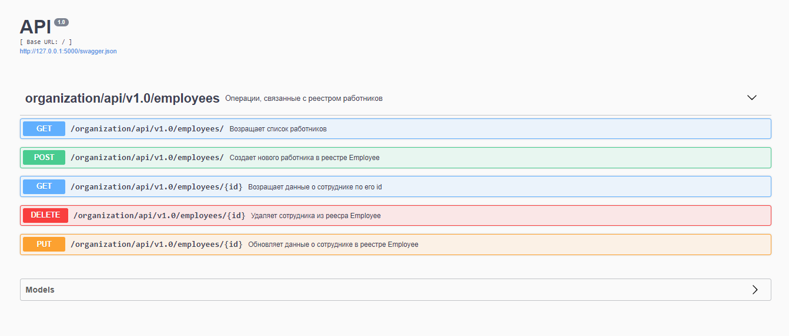

# org_api - проект rest-сервиса на python 3
Это проект для демонстрации работы связки технологий python / REST / ORM / docker.
Приложение представляет из себя микросервис, обрабатывающий запросы по созданию, редактированию, чтению и удалению (CRUD) данных о сотрудниках организации.
В качестве сервера используется flask и его расширение restplus.
БД - sqlite3
ORM - SQLAlchemy
Возможна работа в качестве docker контейнера.

## Запуск проекта
Для запуска проекта следуйте следующим инструкциям.

### Вариант 1: запуск проекта из исходников
Перейдите в корень директории проекта и запустите следующие команды:
#### Unix/MacOS:
    1. pip3 install -r requirements.txt
    2. cp -a sources/fields.py {путь до библиотек питона}/flask_restplus/fields.py
    3. cp -a sources/api.py {путь до библиотек питона}/flask_restplus/api.py
    4. python3 app.py

#### Windows:
    1. pip install -r requirements.txt
    2. copy sources/fields.py {путь до библиотек питона}/flask_restplus/fields.py
    3. copy sources/api.py {путь до библиотек питона}/flask_restplus/api.py
    4. python app.py

### Вариант 2: запуск в контейнере docker
Перейдите в корень директории проекта и запустите следующие команды:
    ```1. docker build . --tag restapi_app```
    ```2. docker run -d -p 5000:5000 restapi_app```

Результат будет доступен по адресу http://localhost:5000/

